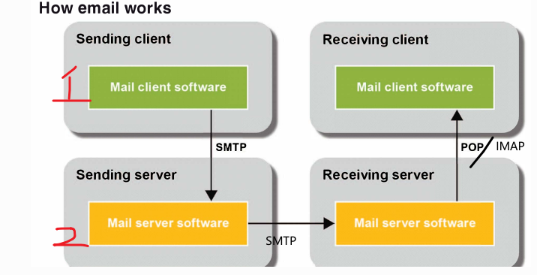

# Intro
This is a repository about  Java Servlets and JSP. The reference book is Murach’s Java Servlets and JSP (3rd Edition)
whose link is [Murach’s Java Servlets and JSP (3rd Edition)](https://www.murach.com/shop-books/java-programming-books/murach-s-java-servlets-and-jsp-3rd-edition-detail)
.You can **DOWNLOAD** book applications and exercises from the official website  for **FREE**.
Since the resources provided were implemented by NetBeans, I picked some projects and exported them to **Intelli J IDEA**.

# Notes
Nowadays, should we learn servlets and jsp ? Are they outdated ? If you have questions like these,you can check the links below
- [Are servlets outdated?](https://www.quora.com/Are-servlets-outdated)
- [Is jsp still used?](https://www.quora.com/Is-JSP-used-JSP-is-almost-unused-nowadays-but-Spring-Boot-is-very-popular-nowadays-and-it-uses-JS-Is-JSP-popular-or-not)

In short, servlets are the solid foundation of web frameworks like spring, so they are never outdated. However, jsp is the oldest of the server-side rendered technologies, 
there are much better ones to replace.

Therefore, **you need to grasp the concepts about servlets , and just know the very basic usage of jsp** (for the completeness of this book) .

# More about the learning trip

The chapters I don't mention here are informative enough, no more hints are needed, just read. If you encounter problems, search the internet.

## Chapter 10 -- how to use custom jsp tags.
You can freely skip this chapter.

## Chapter 11 -- how to use a MySQL database
For those who are not familiar with MySQL, you can watch [MySQL Tutorial for Beginners ](https://www.youtube.com/watch?v=7S_tz1z_5bA) as 
the supplement of this chapter.

## Chapter 12 -- How to use JDBC to work with a database

 **JDBC** is a java API that specifies how to interact with the database, and 
different database vendors like mysql and oracle have their  own implementations. JDBC works on a low level, so it might be hard to use. 
However, due to the fact that many ORM frameworks are built on JDBC, it is better to know how JDBC works. Besides JDBC, another topic in 
the chapter is **connection pooling**,  the advent of which adds much convenience and efficiency to manipulating the database.
Connection pooling is a technique to manage connections between the web server and database system, many companies have developed different products like C3P0 and druid.
For more about JDBC, ORM Frameworks, Connection pooling, you can check  [Java and Database](https://www.marcobehler.com/guides/java-databases).

## Chapter 13 -- How to use JPA to work with a database
Here is the nice introduction to JPA on page 422:
> JPA (Java Persistence API) is an object-relational mapping specification that makes it easier to convert between the business objects and 
> the relational database of an application. This is also known as O/R mapping or ORM. 

> JPA offers several features that make it easier to use than JDBC. First, JPA can automatically create database tables based on relationships
> between business objects. Second, JPA can automatically convert between objects and rows in a relational database. 
> Third, JPA can automatically perform joins to satisfy relationships between objects. 

> JPA runs on top of JDBC. As a result, it's compatible with any database that has a JDBC driver.

In this chapter, we will use one implementation of JPA, EclipseLink. If you want to know how to  build a jpa project in intelliJ IDEA, check this link: 
[creating a simple jakarta persistence application](https://blog.jetbrains.com/idea/2021/02/creating-a-simple-jakarta-persistence-application/).
One notice in advance: Since we will build a web application , **we choose the template of web application instead of library**.

In the section of how to modify data, you may wonder why we delete a single entity by  `em.remove(em.merge(user))`instead of `em.remove(user)` and 
what attached entity means. I guess the author is trying to make things clear and simple, but it still seems quite weird  when the obscure terminologies show
around all of a sudden. Under the hood, the jpa specifications state four states of an entity, which can be **new, managed, removed and detached**. An 
exception will arise if you pass a detached object to the remove method, so you should first convert one possible detached entity into a managed one. It
is still confusing , right?  If so, I recommend you read the section of 3.2 Entity Instance’s Life Cycle in
[jakarta persistence spec 3.0](https://jakarta.ee/specifications/persistence/3.0/jakarta-persistence-spec-3.0.pdf).
Supposing that still can not solve your question, please feel free to search the internet.

You might be puzzled by the differences between flush and commit, please check [correct use of flush in jpa hibernate](https://stackoverflow.com/questions/4275111/correct-use-of-flush-in-jpa-hibernate)
and [how we can get jpa entity manager flush work](https://stackoverflow.com/questions/8863725/how-we-can-get-jpa-entitymanager-flush-work). After testing in
my workspace, it seems like flush sends sql statements to database and commit asks the database to execute them.

During the time I was working on the exercises, a lot of troubles showed up. First, Servlet 5.0 is compatible with tomcat 10, so if you run a project of servlet 5.0 
on tomcat 9 or a project of Servlet 4.0 on tomcat 10, you will get some exceptions like `servlet.ServletException: Error instantiating servlet class `. Find the 
solution via this link : [servlet 5.0 jar throws compile error on javax servlet but servlet 4.0 jar does](https://stackoverflow.com/questions/64387472/servlet-5-0-jar-throws-compile-error-on-javax-servlet-but-servlet-4-0-jar-does)
. Seco  nd, if you work on a project of Servlet 5.0 and jstl-core 1.2, you may encounter exception like `org.apache.jasper.JasperException`, that is still 
compatibility  problem, check this: [how to install jstl on tomcat](https://stackoverflow.com/questions/4928271/how-to-install-jstl-it-fails-with-the-absolute-uri-cannot-be-resolved-or-una).

## Chapter14 -- How to use JavaMail to send email
The exercise of the chapter is associated with two kinds of SMTP servers, one is local SMTP server, 
and the other is remote SMTP server. And both of them are  the servers that **SEND** emails.

To be more specific, in the picture above, we should concentrate on two things: one is the program we are developing, 
 and two is the SMTP server sends emails.

If you are working on the local SMTP server,  you should install one first. Check the [local-smtp-server-to-send-mail](https://stackoverflow.com/questions/14570471/local-smtp-server-to-send-mail),
and the one I downloaded is SMTP4DEV. It is important to know that the local SMTP sever we are using are only for **DEVELOPING and 
TESTING**, and it does not really send emails through internet ,so the email address of the sender and the recipient(s) does not
matter.

If you are working on the remote SMTP sever,and Gmail happens to be the one you pick, I assume you will encounter
`javax.mail.AuthenticationFailedException`. If so, check this [javax-mail-authenticationfailedexception](https://stackoverflow.com/questions/32303910/javax-mail-authenticationfailedexception-java-mail?rq=3)
, and it tells you to visit the Google official website to check something like less secure apps. If you don't have the turn on/off option,
check this [video](https://www.youtube.com/watch?v=Gu4ifdBkrNM), my case is slightly  different from the video , but
the result is the same : **the 16 bits application password generated for replacing password bound with your gmail account**,
i.e, you should use the 16 bits application password instead of  you own gmail password. And you should know that the gmail 
smtp server will truly send emails, and the sender is always the account bound with the program even if you type in someone else's 
email address in the program, and the recipient(s) is(are) the real ones to receive your emails.

If you are careful enough, you will see that the hosts and ports of the local SMTP sever are different from the ones of  remote 
SMTP servers. It is true, for more details, you should take a lesson called Network, but  for now, just leave them behind and 
keep on.

## Chapter16 -- How to restrict access to a web resource
First of all, The JDBCRealm is obsolete and does not work in my case. If you simply replace JDBCRealm with DataSourceRealm, it does not work either.
Instead, you should try the DataSourceRealm with connection pooling mentioned in the book and that works for me.

When working on form-based authentication, use post method instead of get method in `admin/login_error.html` and `admin/login.html`,
for it is much safer and if you don't do so, something weird will happen. Besides, If you find the css effect is not correct , that 
is the path problem, replace `<a href="admin">` with `<a href="admin/index.jsp">` in `index.jsp`.

